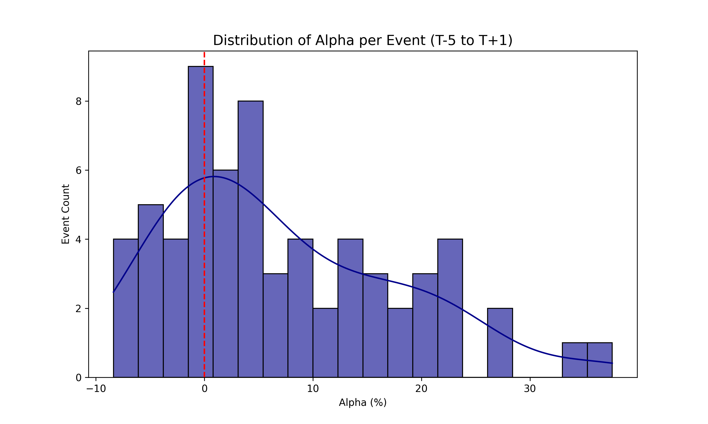
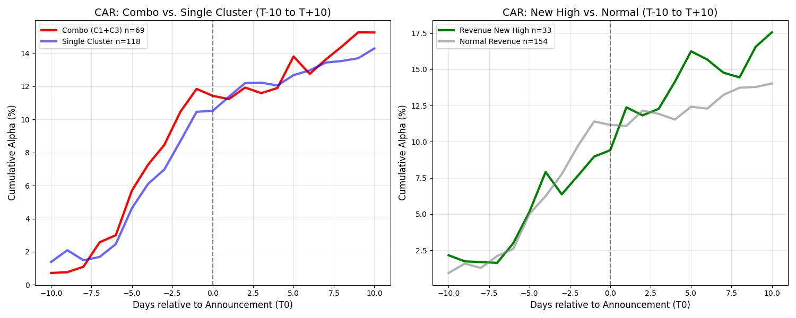
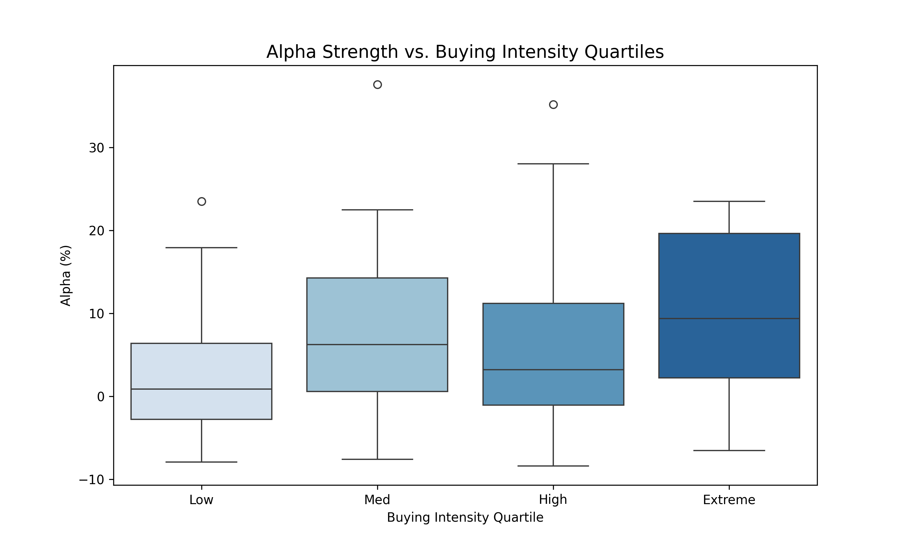
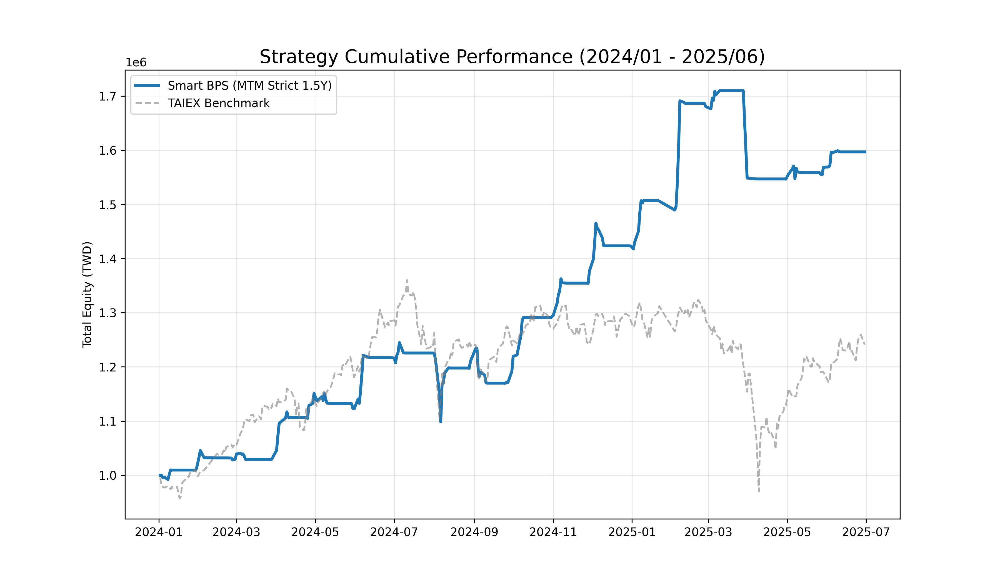
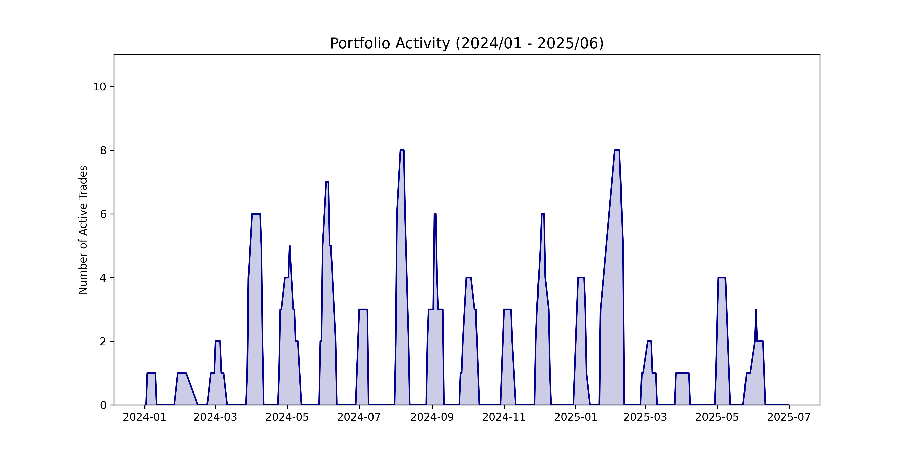

# 台股量化策略研究報告：營收前瞻 Alpha 實證 (2024/01 - 2025/06)

本研究利用行為金融學與機器學習技術，針對台股成交量前 200 大標的進行實證，開發出一套「知情分點 (Informed Clusters)」識別模型，藉由偵測其在營收公告前的先行佈局行為，捕捉非對稱資訊帶來的 Alpha。

---

## 一、 執行摘要 (Executive Summary)
本研究實證了「知情交易流」在營收公告前的顯著預測力。透過滾動式 PCA 降維與 K-Means 分群，策略在 **68 筆** 高度共振的交易中達成：
- **平均單次 Alpha**: **7.40%**
- **勝率 (Win Rate)**: **76.47%**
- **最大回撤 (MDD)**: **-11.76%** (含 2024/08 市場修正)

本框架徹底消除了前視偏誤，並計入 0.4% 之真實摩擦成本與逐日評價波動。

---

## 二、 核心名詞與指標定義
1. **聰明錢群組 (Informed Clusters)**: 指操作績效優異且行為穩定的分點集合。識別基準為該群組在過去 125 天內同時滿足「預估損益 > 0」（贏面指標）與「高留倉比」（信心指標）。
2. **預估損益 (Estimated Profit)**: 公式：`(期間賣出金額 + 期末庫存市值) - 期間買進總成本`。用以定義該分點是否為該標的的贏家。
3. **留倉比 (Overnight Ratio)**: `|淨買賣量| / 總成交量`。比值越高（接近 1）代表分點傾向於持股過夜（波段主力）；比值低則偏向日內沖銷（當沖客）。
4. **買盤強度 (Buying Intensity)**: 聰明錢群組在公告前 [T-7, T-1] 區間的累積淨買超規模。

---

## 三、 實作流程與數據處理
1. **數據漏斗篩選**: 鎖定成交金額前 200 大標的。要求觀察期內具備充足數據密度（交易天數 > 5 天），以確保 K-Means 分群的穩定性，排除隨機偏誤。
2. **空間降維 (PCA)**: 利用 PCA 提取「前 3 個主成分」，過濾分點細節數據中的噪音，並消除行為特徵間的相關性。
3. **滾動行為分群**: 在降維空間運行 K-Means (k=4)，動態標籤化主力。決策完全基於歷史數據，杜絕前視偏誤。
4. **訊號觸發**: 僅在「贏家且波段」的群組出現顯著淨買進時觸發 T-5 進場與 T+1 出場。
5. **實戰風控**: 引入 **-5% 硬性價格止損** 與 **籌碼失效止損** (偵測到主力反手賣出 > 50% 強度時提前離場)。

---

## 四、 事件統計績效 (Alpha Attribution)

| 研究指標 | 實證結果 |
| :--- | :--- |
| **Average Alpha per Event** | **7.40%** |
| **Win Rate (Alpha > 0)** | **76.47%** |
| **Total Valid Trades (N)** | **68** |
| **Stop Loss Threshold** | **-5.00%** |
| **Transaction Cost** | **0.40% Round-trip** |

### Alpha 分佈分析
Alpha 分佈展現出明顯的正偏態 (Positive Skew)。止損機制有效截斷風險，使右側飆股行情貢獻了極佳的期望值。

---

## 五、 領先性驗證 (CAR 分析)
累積異常報酬 (CAR) 曲線證實知情買盤領先營收公告約 5-7 個交易日。T-5 (進場點) 是 Alpha 累積斜率最陡峭的起點，而 T+1 (出場點) 則是獲利反映的階段性頂峰。

---

## 六、 買盤強度與獲利歸因
箱型圖證實，買盤強度與 Alpha 中位數呈單調上升。Extreme 組的表現證明了：**集中的主力買盤是預測營收利多最穩定的量化指標。**

---

## 七、 投資組合回測與資金利用率
### 淨值曲線 (Mark-to-Market)
逐日評價曲線顯示，2024 年 8 月的回撤 (-11.76%) 主因市場系統性修正。Smart BPS 訊號在行情復甦時展現了極強的彈性。

### 持倉佔用率 (Portfolio Occupancy)
持倉佔用隨財報賽季規律律動。策略僅在具備資訊優勢時參與，其餘時間保留現金，大幅降低了不必要的曝險。

---

## 八、 實務執行與回測侷限性
1. **公告日不確定性**: 實盤中建議將固定 T-5 進場優化為 **『Z-Score 買盤強度觸發』**。當每月初偵測到知情分點出現 Z-Score > 2 的異常買盤時即進場。
2. **現金稀釋效應**: 事件驅動策略在淡季持有大量現金，會稀釋年化報酬。實戰中應搭配市場中性資產配置。
3. **執行滑價**: 雖然計入 0.4% 成本，但大型權值股公告後的跳空可能造成滑價，需考量權證流動性優化。

---

## 九、 結論
本研究成功定義了台股營收前瞻 Alpha 策略的量化邊界。透過 PCA+K-Means 的嚴謹分群與多重風控，證明了台股籌碼細節中隱含的巨大非對稱資訊價值。

---
Managed by **Gemini CLI** | 2026-03-09
