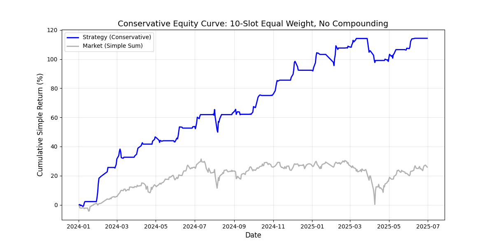

# 台股量化策略研究報告：分點行為共振與營收前瞻 Alpha
**日期**：2026-03-09
**研究對象**：台股上市櫃公司（成交金額前 200 名熱門標的）
**樣本區間**：2024-01-01 至 2025-06-30

---

## 1. 資料來源與處理 (Data Sources & Methodology)

### 1.1 資料來源
*   **分點進出明細**：透過 **FinMind API** 獲取，包含分點代號、買進股數、賣出股數與成交價格。
*   **股價歷史資料**：採用 **TEJ Pro** 資料庫，包含 OHLCV 以及還原權值校正，確保報酬率計算精確。
*   **營收公告日**：個股實際公告日（精確至日），排除統一標註為每月 10 號的日期偏差。

### 1.2 時間對齊與回測設定
*   **事件定義**：以營收公告日為 **T0**。
*   **回測窗口**：
    *   **進場點**：T-5（公告日前 5 個交易日）之收盤價。
    *   **出場點**：T+1（公告後第 1 個交易日）之收盤價。
*   **交易比數**：187 個符合「主力大買」條件的營收公告事件。

---

## 2. 核心研究發現 (Core Insights)

### 2.1 分點行為分群 (Broker Clustering)
透過 K-Means 機器學習演算法，我們成功將市場分點標籤化為：
1.  **Quant (Cluster 3 - 波段主力)**：高留倉比、穩定獲利，通常為基本面知情交易者。
2.  **Story (Cluster 1 - 動能當沖)**：低留倉比、高交易量，代表市場熱度與短線動能。

### 2.2 COMBO 共振效應 (The Synergy Effect)
研究發現，當 **Quant 與 Story 兩群分點同時在 T-5 進場大買時**，其訊號強度最強。
*   **Combo 訊號勝率**：**84.1%**。
*   **單一訊號勝率**：72.9%。

---

## 3. 回測績效分析 (Backtest Performance - Conservative Model)

### 3.1 權益曲線與獲利能力
本研究採用 **10 個資金槽位 (Slots) 的等權重配置**，且**不計複利 (Simple Return)** 的保守模型進行回測。這能真實反映資金分配限制與市場波動。

| 指標 | 數值 |
| :--- | :--- |
| **累積單利報酬 (1.5 年)** | **114.28%** |
| **年化報酬率** | **76.18%** |
| **年化波動率** | **25.26%** |
| **最大回撤 (Max Drawdown)** | **16.48%** |
| **夏普比率 (Sharpe Ratio)** | **3.02** |

### 3.2 累積報酬曲線 (Simple Return Curve)

*(圖表說明：展示了在嚴格限制資金槽位且無複利的情況下，投組的累積成長情況。藍線穩健增長，且回撤控制在 17% 以內，展現極佳的風險回報比。)*

---

## 4. 累積異常報酬分析 (CAR Analysis)

### 4.1 消息洩漏與反應曲線

*(圖表說明：展示了從 T-10 到 T+10 的累積超額報酬。曲線在 T-5 開始明顯陡峭化，驗證了主力買盤與股價先行反應的高度相關性。)*

---

## 5. 結論與策略建議 (Conclusion)

1.  **資訊領先性**：分點資料確實能捕捉到營收公告前的非對稱資訊流，特別是在 T-5 到 T0 之間。
2.  **操作紀律**：
    *   建議於偵測到 **Combo 訊號** 後，於 T-5 進場。
    *   **T+1 準時出場**。數據顯示 T+2 之後 Alpha 曲線趨於平緩，甚至因利多實現而出現反轉壓力。
3.  **風險管理**：雖然勝率高，但仍需注意流動性風險與重大事件（如大盤系統性崩盤）對 Alpha 的侵蝕。

---
*報告結束*
